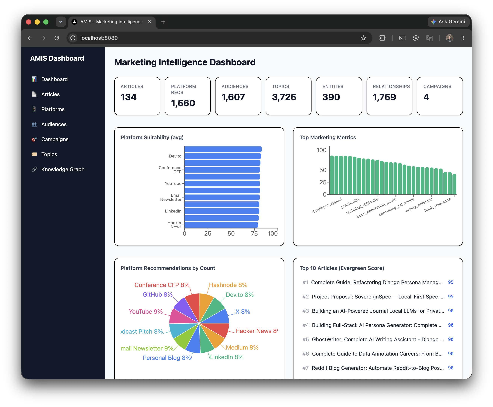

# AMIS — Agentic Marketing Intelligence System



Turn a corpus of Markdown blog posts into an autonomous marketing knowledge graph that plans, ranks, recommends, and generates campaigns.

This is not a social media post generator. This is a **reasoning engine** that understands relationships between articles, products, repositories, audiences, and marketing channels — all running locally with no cloud dependency for core operation.

## Architecture

```
Markdown Corpus  →  Ingestion  →  Semantic Analysis  →  Knowledge Graph
                                                             │
                                    Campaign Planner ◄───────┼─── Ranking
                                         │                   │
                                    Agent Interface ◄── Recommendation Engine
```

All structured data lives in a single SQLite database. Vectors live in ChromaDB. The graph is stored as adjacency lists in SQLite with JSON snapshot exports. Every LLM inference is persisted with full reasoning trace.

## 16-Phase Pipeline

| Phase | Component | What It Does |
|-------|-----------|-------------|
| 1 | **Ingestion** | Parse frontmatter, extract headings/images/links/code, store normalized |
| 2 | **Semantic Analysis** | Score 27 marketing dimensions per article (LLM) |
| 3 | **Topic Extraction** | Build normalized taxonomy across 13 categories |
| 4 | **Entity Recognition** | Extract people, companies, repos, products, technologies |
| 5 | **Knowledge Graph** | 17 relationship types, typed edges with weights |
| 6 | **Duplicate Detection** | Exact, near-duplicate, outdated content detection |
| 7 | **Marketing Ranking** | Weighted composite scores across 12 dimensions |
| 8 | **Audience Mapping** | 12 audience personas with relevance scoring |
| 9 | **Platform Recommendation** | 12 platforms scored per article (LinkedIn, X, Dev.to, etc.) |
| 10 | **Campaign Planner** | Multi-step campaign generation with schedules |
| 11 | **Content Repurposing** | 10 target formats (thread, newsletter, talk, workshop, etc.) |
| 12 | **Marketing Memory** | Append-only reasoning history, never regenerates identical decisions |
| 13 | **Analytics Schema** | Ready for metrics import (views, clicks, conversions, sales) |
| 14 | **Recommendation Engine** | 11 query types: best today, hidden gems, underutilized, needs update, etc. |
| 15 | **Agent Interface** | 10 structured tools for autonomous agents + optional MCP server |
| 16 | **Autonomous Loop** | Nightly: ingest → graph → score → campaign → report |

## Quick Start

```bash
# Install
python3 -m venv .venv && source .venv/bin/activate
pip install -e .

# Phase 1: Ingest blog posts
python3 -m src.cli ingest

# Phase 5: Build knowledge graph
python3 -m src.cli graph

# Phase 7: Compute marketing rankings
python3 -m src.cli rank

# Phase 14: Query recommendations
python3 -m src.cli recommend today
python3 -m src.cli recommend update
python3 -m src.cli recommend gems

# Full pipeline (requires Ollama)
python3 -m src.cli pipeline
```

LLM-powered phases (semantic analysis, topic extraction, entity recognition, audience mapping, platform recommendations, campaign generation, content repurposing) require an Ollama instance or OpenAI-compatible endpoint. Configure in `configs/amis.yaml`.

## Tech Stack

| Component | Choice | Rationale |
|-----------|--------|-----------|
| Language | Python 3.11+ | Broad ecosystem, async support |
| Structured storage | SQLite | Single-file, zero-config, portable |
| Semantic search | ChromaDB | Local vector store, HNSW indexing |
| Graph model | Adjacency list in SQLite | Separate from documents, exportable |
| LLM reasoning | Ollama / OpenAI | Local-first, swappable backend |
| Markdown parsing | markdown-it-py + python-frontmatter | Full AST, frontmatter support |
| Embeddings | Sentence Transformers | Local, offline-capable |

## Design Principles

- **Local-first** — no cloud dependency for core operation
- **Markdown is source of truth** — all intelligence derives from authored content
- **LLM only where reasoning is required** — parse deterministically, reason selectively
- **Every inference stored** — append-only reasoning trace with model, prompt, and confidence
- **Idempotent ingestion** — same input always produces same output
- **No UI assumptions** — pure structured API for autonomous agents

## CLI Reference

```bash
amis ingest              # Parse and store all markdown files
amis analyze             # Run semantic analysis (LLM)
amis topics              # Extract topics (LLM)
amis entities            # Extract entities (LLM)
amis graph               # Build knowledge graph
amis graph-export        # Export graph as JSON
amis duplicates          # Find duplicate content
amis rank                # Compute marketing rankings
amis rankings            # Show ranked articles
amis audiences           # Map audience personas (LLM)
amis platforms           # Platform recommendations (LLM)
amis campaign            # Generate campaign (LLM)
amis repurpose           # Content repurposing (LLM)
amis pipeline            # End-to-end pipeline (LLM)
amis nightly             # Autonomous loop (LLM)
amis recommend <type>    # Query recommendations
amis tool <name>         # Agent tool interface
```

## Agent Tools

Ten structured tools for autonomous agents:

```python
tools.find_best_articles(platform="LinkedIn")
tools.generate_campaign(goal="book_sales", audience="developers")
tools.recommend_platform(article_id=42, top_n=3)
tools.rank_articles(dimension="authority")
tools.find_hidden_gems(min_score=70)
tools.find_duplicate_content()
tools.find_missing_topics()
tools.recommend_book_marketing()
tools.recommend_consulting_content()
tools.generate_monthly_plan()
```

## Project Structure

```
amis/
├── src/                  # 2,400 lines across 31 modules
│   ├── cli.py            # CLI entry point
│   ├── config.py         # YAML config management
│   ├── db/               # SQLite connection + 15-table schema
│   ├── ingestion/        # Phase 1: markdown parsing
│   ├── analysis/         # Phases 2-4: semantic, topics, entities
│   ├── graph/            # Phases 5-6: graph + duplicates
│   ├── marketing/        # Phases 7-11: ranking, audiences, platforms, campaigns, repurposing
│   ├── memory/           # Phase 12: reasoning history
│   ├── recommendations/  # Phases 14-15: engine + agent tools
│   ├── llm/              # Ollama/OpenAI client + prompts
│   └── loop/             # Phase 16: autonomous pipeline
├── content/posts/        # 134 blog posts (canonical corpus)
├── docs/                 # 23 implementation documents
├── configs/amis.yaml     # System configuration
└── pyproject.toml        # Package definition
```

## License

MIT
